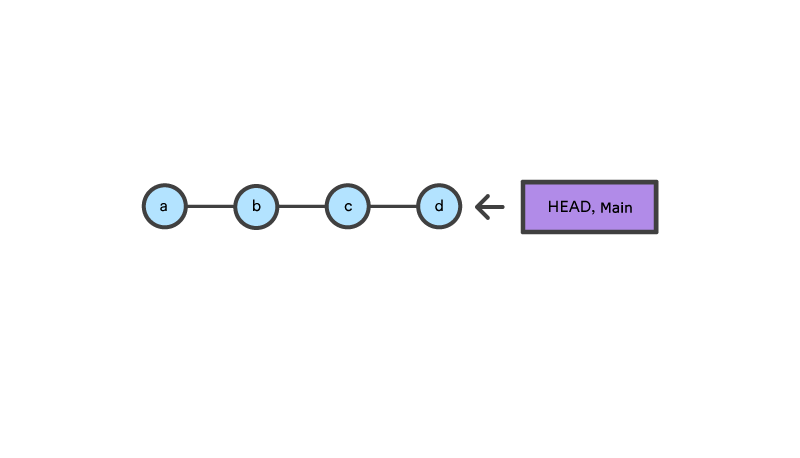
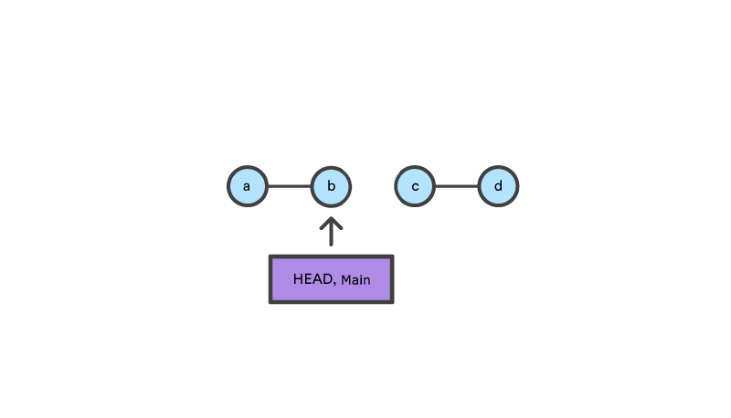
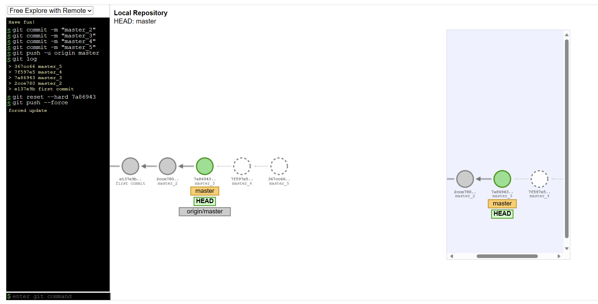

# Git reset

The git reset command is a complex and versatile tool for undoing changes. It has three primary forms of invocation. These forms correspond to command line arguments `--soft, --mixed, --hard`. The three arguments each correspond to Git's three internal state management mechanism's, The Commit Tree (HEAD), The Staging Index, and The Working Directory.

### `git reset b`

Comparatively, git reset, moves both the HEAD and branch refs to the specified commit.

In addition to updating the commit ref pointers, git reset will modify the state of the three trees. The ref pointer modification always happens and is an update to the third tree, the Commit tree. The command line arguments --soft, --mixed, and --hard direct how to modify the Staging Index, and Working Directory trees.

## Main option

### `--hard`
    
This is the most direct, DANGEROUS, and frequently used option. When passed `--hard` The Commit History ref pointers are updated to the specified commit. Then, the Staging Index and Working Directory are reset to match that of the specified commit. Any previously pending changes to the Staging Index and the Working Directory gets reset to match the state of the Commit Tree. This means any pending work that was hanging out in the Staging Index and Working Directory will be lost.

### `--mixed`

This is the default operating mode. The ref pointers are updated. The Staging Index is reset to the state of the specified commit. Any changes that have been undone from the Staging Index are moved to the Working Directory.

### `--soft`

When the --soft argument is passed, the ref pointers are updated and the reset stops there. The Staging Index and the Working Directory are left untouched. This behavior can be hard to clearly demonstrate. Let's continue with our demo repo and prepare it for a soft reset.

## Use case

Update to remote repository by using `git push --force` or `git push -f`

