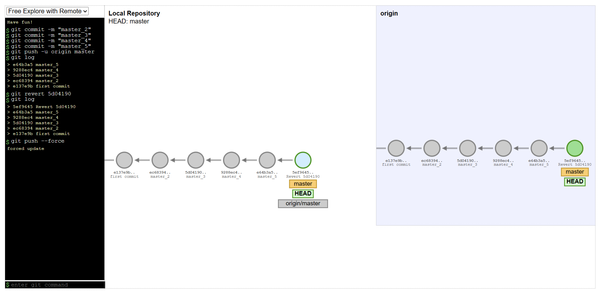

# Git revert

The git revert command can be considered an 'undo' type command, however, it is not a traditional undo operation. Instead of removing the commit from the project history, it figures out how to invert the changes introduced by the commit and appends a new commit with the resulting inverse content. This prevents Git from losing history, which is important for the integrity of your revision history and for reliable collaboration.

Reverting should be used when you want to apply the inverse of a commit from your project history. This can be useful, for example, if you’re tracking down a bug and find that it was introduced by a single commit. Instead of manually going in, fixing it, and committing a new snapshot, you can use git revert to automatically do all of this for you.

## Common options

#### `-e` or `--edit`
This is a default option and doesn't need to be specified. This option will open the configured system editor and prompts you to edit the commit message prior to committing the revert

#### `--no-edit`
This is the inverse of the -e option. The revert will not open the editor.

#### `-n` or `--no-commit`
Passing this option will prevent git revert from creating a new commit that inverses the target commit. Instead of creating the new commit this option will add the inverse changes to the Staging Index and Working Directory. These are the other trees Git uses to manage the state of the repository. For more info visit the git reset page.

## Use case

